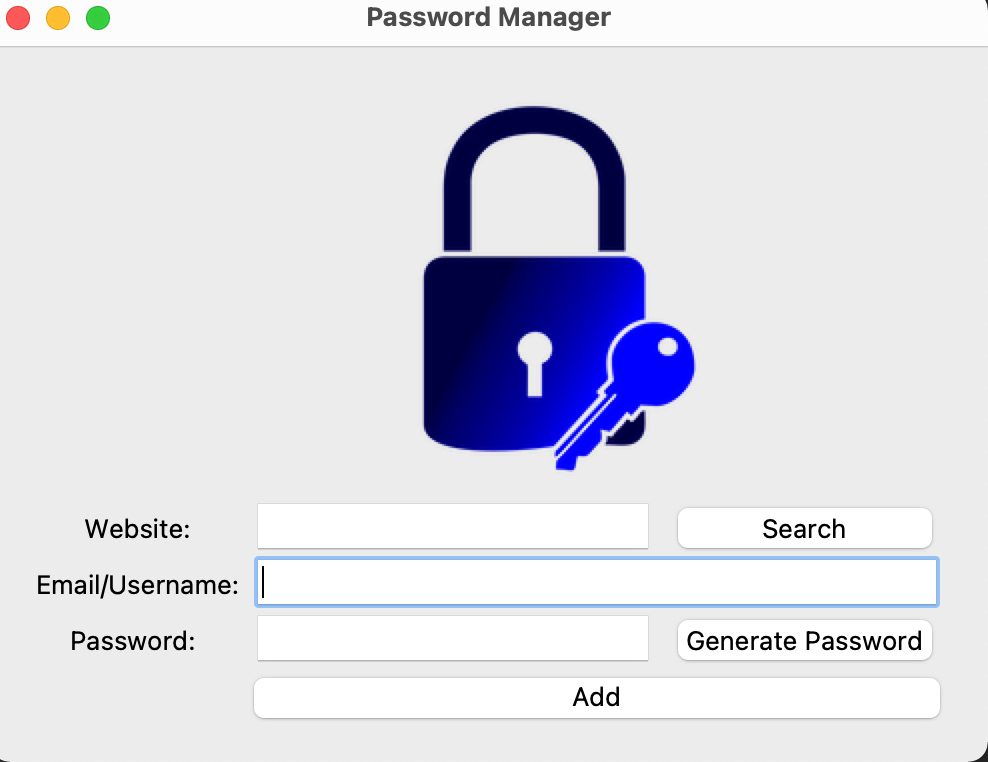
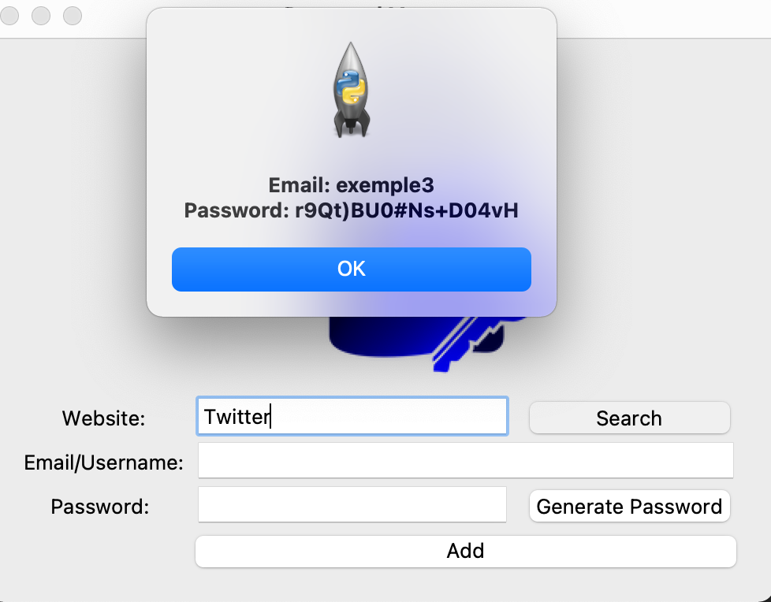
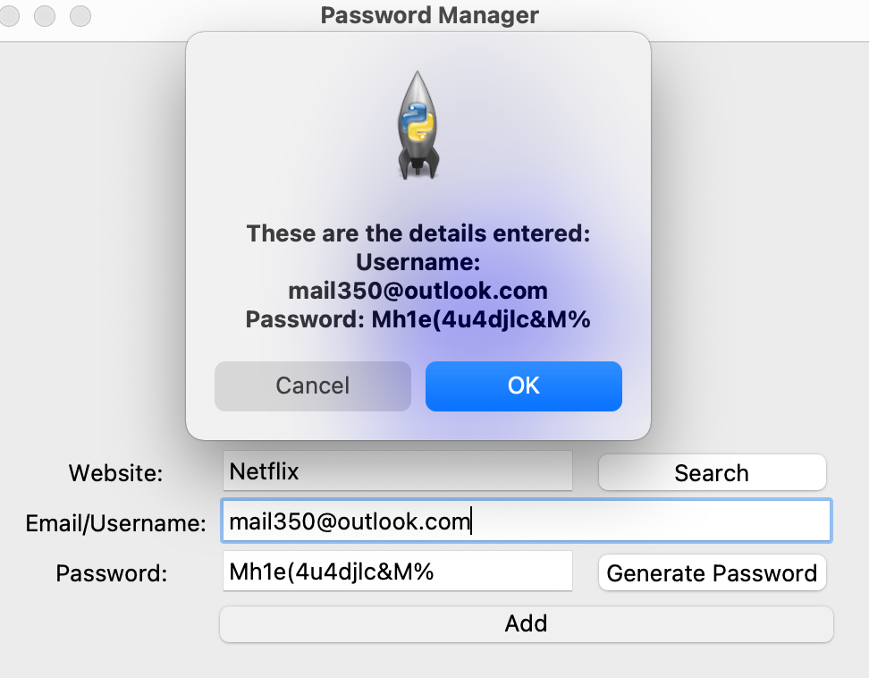
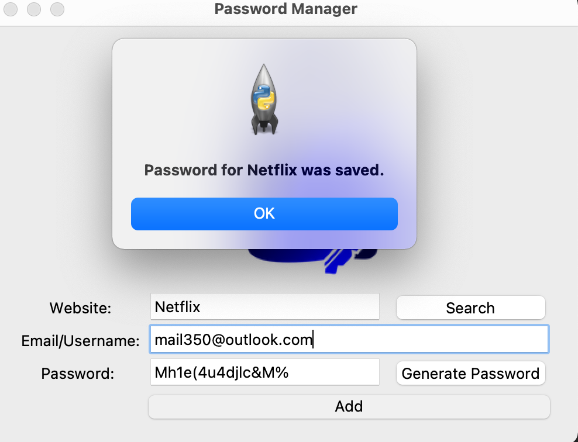
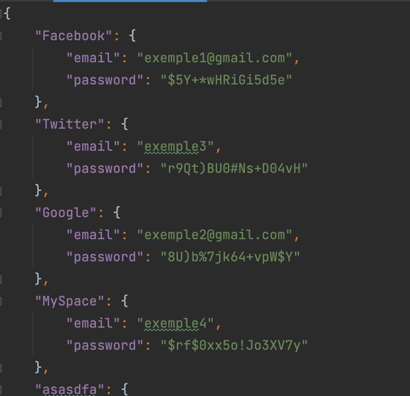

# Password Manager

A powerful solution that assists individuals and businesses in securely storing and managing all of their login details. The program uses tkinter library for GUI as well as pyperclip, and json library to store the data localy. 
The program allows for a search for the username and password based on the website entered.  Finally, the program allows from a click of a button
to generate secure passwords. 

## Features

- Fully functional GUI
- Low memory usage
- Cross platform
- Password auto clipboard 
- Local storage
- Search
- Auto generates complex random passwords with a click of a button

## Authors

- [@sanduler](https://github.com/sanduler)

## Screenshots

--------------------------------

--------------------------------

--------------------------------

--------------------------------

## License

[MIT](https://choosealicense.com/licenses/mit/)

